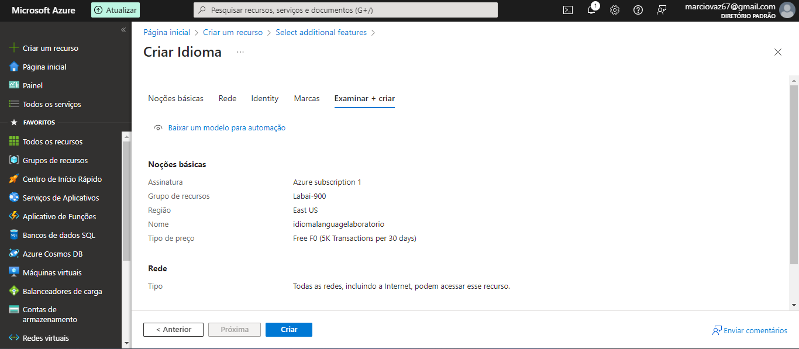
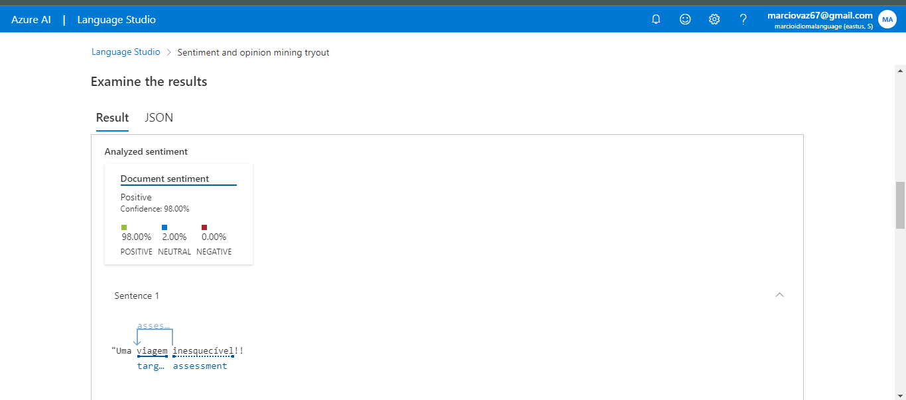
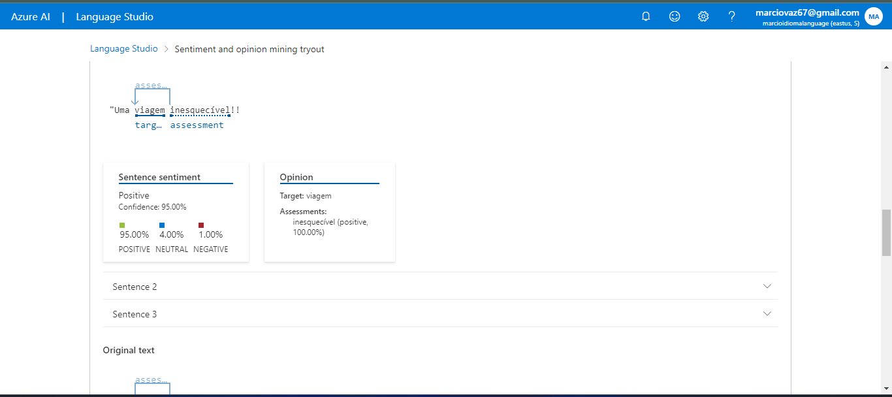

# Análise de Sentimentos com Language Studio no Azure AI

## Configure seu recurso no Azure AI Language Studio

### Em outra guia do navegador, abra o Language Studio em https://language.cognitive.azure.com e entre.

Quando solicitado com Select an Azure resource , faça as seguintes configurações:

<ul>

<li>Diretório do Azure : diretório padrão, o diretório que você está usando</li>
<li>Assinatura do Azure : selecione a assinatura que você está usando</li>
<li>Tipo de recurso : Idioma</li>
<li>Nome do recurso : selecione o recurso de serviço de idioma que você acabou de criar</li>
</ul>
Em seguida, selecione Concluído .

### Resultado Análise Sentimento

### Resultado Sentença Sentimento

Aprendi sobre a capacidade dessa ferramenta para analisar o sentimento expresso em textos. Com essa tecnologia, é possivel identificar se o sentimento é positivo, negativo ou neutro, o que é útil para diversas aplicações, como análise de feedback de clientes, monitoramento de mídias sociais e compreensão da opinião pública sobre determinados assuntos.
